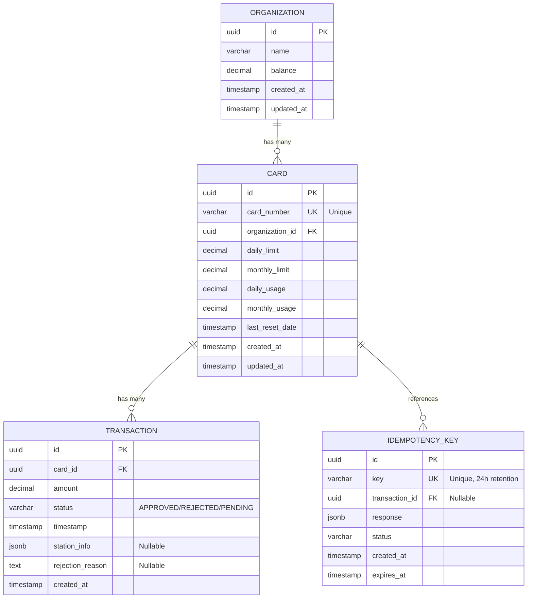

# Entity-Relationship Diagram (ERD)

## Database Schema

## Relationships

### Organization → Card (One-to-Many)

- **Relationship**: One organization can have multiple cards
- **Foreign Key**: `card.organization_id` → `organization.id`
- **Cascade**: Delete organization deletes all associated cards

### Card → Transaction (One-to-Many)

- **Relationship**: One card can have multiple transactions
- **Foreign Key**: `transaction.card_id` → `card.id`
- **Cascade**: Delete card deletes all associated transactions

### Card → IdempotencyKey (One-to-Many)

- **Relationship**: One card can have multiple idempotency keys (via transactions)
- **Foreign Key**: `idempotency_key.transaction_id` → `transaction.id` (indirect)
- **Note**: Used for duplicate detection in webhook processing

## Indexes

### Cards Table

- `idx_cards_card_number` on `card_number` (unique constraint)
- `idx_cards_organization_id` on `organization_id`

### Transactions Table

- `idx_transactions_card_id` on `card_id`
- `idx_transactions_timestamp` on `timestamp`
- `idx_transactions_status` on `status`
- `idx_transactions_card_id_timestamp` on `(card_id, timestamp)` (composite)

### IdempotencyKeys Table

- `idx_idempotency_keys_key` on `key` (unique constraint)

## Key Constraints

1. **Unique Constraints**:
    - `card.card_number` - Each card number must be unique across the system
    - `idempotency_key.key` - Each idempotency key must be unique

2. **Foreign Key Constraints**:
    - All foreign keys enforce referential integrity
    - Cascade deletes ensure no orphaned records

3. **Not Null Constraints**:
    - All primary keys
    - `organization.name`, `organization.balance`
    - `card.card_number`, `card.organization_id`, all limit fields
    - `transaction.card_id`, `transaction.amount`, `transaction.status`
    - `idempotency_key.key`, `idempotency_key.response`, `idempotency_key.status`

## Data Types

- **UUID**: Primary keys and foreign keys for globally unique identifiers
- **DECIMAL(10,2)**: Financial amounts (balance, limits, usage)
- **VARCHAR**: Text fields (names, card numbers, status)
- **TIMESTAMP**: Date/time fields (created_at, updated_at, timestamps)
- **JSONB**: Flexible data storage (station_info, idempotency response)
- **TEXT**: Long text fields (rejection_reason)

## Business Rules

1. **Balance Management**:
    - Organization balance must be non-negative after transactions
    - Balance deducted atomically with transaction approval

2. **Limit Enforcement**:
    - Daily usage cannot exceed daily limit
    - Monthly usage cannot exceed monthly limit
    - Limits automatically reset based on `last_reset_date`

3. **Transaction States**:
    - `PENDING`: Initial state when transaction created
    - `APPROVED`: Transaction validated and balance deducted
    - `REJECTED`: Transaction failed validation (with reason)

4. **Idempotency**:
    - Keys expire after 24 hours
    - Prevents duplicate transaction processing
    - Optional feature (webhook can work without it)
